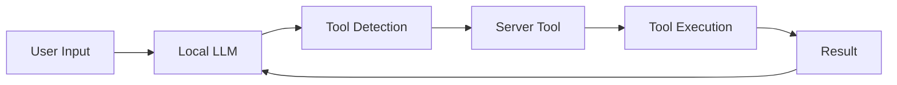

# MCP (Model Control Protocol) Tools

This directory contains various MCP tools and agents that can be built as part of the llama.cpp project.

## Architecture

Each subdirectory represents a standalone MCP tool/agent that:
- Uses the cpp-mcp library (from `vendor/cpp-mcp`)
- Can be built independently via CMake flags
- Follows the server/client architecture for tool execution

### Current Structure
```
tools/mcp/
├── CMakeLists.txt           # Main CMake config with build flags
├── simple-mcp-agent/        # Example agent with shell command tool
│   └── CMakeLists.txt      # Agent-specific build config
└── simple-mcp-client/       # Example client implementation
    └── CMakeLists.txt      # Client-specific build config
```

## Build System Integration

The MCP tools follow a flag-based build system where:
1. Each subdirectory has its own CMake flag (e.g., `LLAMA_BUILD_SIMPLE_MCP_AGENT`)
2. Tools are only built when their specific flag is enabled
3. The cpp-mcp library is automatically included when any tool is enabled

### Current Build Flags
- `LLAMA_BUILD_SIMPLE_MCP_AGENT` - Build the simple MCP agent
- `LLAMA_BUILD_SIMPLE_MCP_CLIENT` - Build the simple MCP client

## Building Tools

From the project root:
```bash
# Build specific tool
cmake -B build -DLLAMA_BUILD_SIMPLE_MCP_AGENT=ON
cmake --build build

# Build multiple tools
cmake -B build -DLLAMA_BUILD_SIMPLE_MCP_AGENT=ON -DLLAMA_BUILD_SIMPLE_MCP_CLIENT=ON
cmake --build build
```

## Adding New Tools

To add a new MCP tool/agent:

1. **Create Directory Structure**
   ```bash
   tools/mcp/my-new-tool/
   ├── CMakeLists.txt
   └── my-new-tool.cpp
   ```

2. **Add Build Flag** in `tools/mcp/CMakeLists.txt`:
   ```cmake
   option(LLAMA_BUILD_MY_NEW_TOOL "Build my-new-tool" OFF)

   if(LLAMA_BUILD_MY_NEW_TOOL)
       add_subdirectory(my-new-tool)
   endif()
   ```

3. **Create Tool CMakeLists.txt** in `tools/mcp/my-new-tool/CMakeLists.txt`:
   ```cmake
   # Create executable
   add_executable(llama-my-new-tool my-new-tool.cpp)

   # Link required libraries
   target_link_libraries(llama-my-new-tool PRIVATE 
       mcp        # MCP library
       llama      # llama.cpp core library
       common     # llama.cpp common utilities
       ${CMAKE_THREAD_LIBS_INIT}
   )

   # Add source files if needed
   target_sources(llama-my-new-tool PRIVATE
       ${CMAKE_SOURCE_DIR}/common/arg.cpp
       ${CMAKE_SOURCE_DIR}/common/sampling.cpp
       ${CMAKE_SOURCE_DIR}/common/json-schema-to-grammar.cpp
       ${CMAKE_SOURCE_DIR}/common/chat.cpp
   )

   # Include directories
   target_include_directories(llama-my-new-tool PRIVATE
       ${CMAKE_SOURCE_DIR}/vendor/cpp-httplib
       ${CMAKE_SOURCE_DIR}/vendor/nlohmann
       ${CMAKE_SOURCE_DIR}/vendor/cpp-mcp/include
       ${CMAKE_SOURCE_DIR}/vendor/cpp-mcp/common
       ${CMAKE_SOURCE_DIR}/include
       ${CMAKE_SOURCE_DIR}/common
   )

   target_compile_features(llama-my-new-tool PRIVATE cxx_std_17)
   ```

4. **Implement Your Tool** in `my-new-tool.cpp`:
   - Include required headers
   - Define tool handlers
   - Set up server/client if needed
   - Follow existing examples for structure

5. **Build Your Tool**:
   ```bash
   cmake -B build -DLLAMA_BUILD_MY_NEW_TOOL=ON
   cmake --build build
   ```

## Best Practices

1. **Naming Conventions**
   - Prefix executables with `llama-` (e.g., `llama-my-new-tool`)
   - Use descriptive CMake flags prefixed with `LLAMA_BUILD_`
   - Keep source files named same as directory

2. **Dependencies**
   - All tools should depend on `mcp` library
   - Add only necessary source files to `target_sources`
   - Include all required headers in `target_include_directories`

3. **Integration**
   - Each tool should be independently buildable
   - Follow server/client architecture if using tools
   - Maintain consistent error handling and logging

4. **Documentation**
   - Add usage instructions in source comments
   - Document any special requirements or dependencies
   - Provide example commands/usage

## Examples

### Building a Calculator Agent
```bash
# Build the agent
cmake -B build -DLLAMA_BUILD_SIMPLE_MCP_AGENT=ON
cmake --build build

# Run with local model
./build/tools/mcp/simple-mcp-agent/llama-simple-mcp-agent -m models/7B/ggml-model-q4_0.gguf
```

### Tool Communication Flow


## Testing

When adding a new tool:
1. Test building in isolation
2. Test building with other tools
3. Verify all dependencies are correctly linked
4. Test tool functionality
5. Verify clean build from scratch 